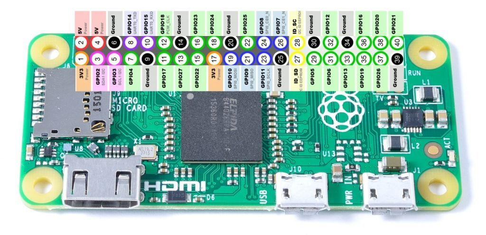

# LED

The multi-color RGB LED status indicator.  It accepts either a combination of color and pattern.

## HEADER




We attach the RGB LED to the last 4 pins 34, 36, 38 and 40 of the outermost row.
From left (sdcard) to right: GND-B-G-R

```
SD ................xxxx
   0...................
```

## Usage

```bash
$ sudo apt install -y rpi.gpio
$ sudo ./LED.py G SUCCESS

```

## LED Colors

| COMMAND | Description                    |
| :------ | :----------------------------- |
| R       | Red                            |
| G       | Green                          |
| B       | Blue                           |
| Y       | Yellow (AKA as Amber)          |
| C       | Cyan (AKA Light Blue)          |
| M       | Magenta (AKA Violet or Purple) |
| W       | White                          |
| O       | Off                            |

## LED Patterns

| PATTERN  | Description                                              |
| :------- | :------------------------------------------------------- |
| SOLID    | *Default* No blink. Used if pattern argument is ommitted |
| SLOW     | Symmetric 1000ms ON, 1000ms OFF, repeating               |
| FAST     | Symmetric 100ms ON, 100ms OFF, repeating                 |
| VERYFAST | Symmetric 10ms ON, 10ms OFF, repeating                   |
| SINGLE   | 1 100ms blink(s) ON followed by 1 second OFF, repeating  |
| DOUBLE   | 2 100ms blink(s) ON followed by 1 second OFF, repeating  |
| TRIPLE   | 3 100ms blink(s) ON followed by 1 second OFF, repeating  |
| QUAD     | 4 100ms blink(s) ON followed by 1 second OFF, repeating  |
| QUIN     | 5 100ms blink(s) ON followed by 1 second OFF, repeating  |
| ISINGLE  | 1 100ms blink(s) OFF followed by 1 second ON, repeating  |
| IDOUBLE  | 2 100ms blink(s) OFF followed by 1 second ON, repeating  |
| ITRIPLE  | 3 100ms blink(s) OFF followed by 1 second ON, repeating  |